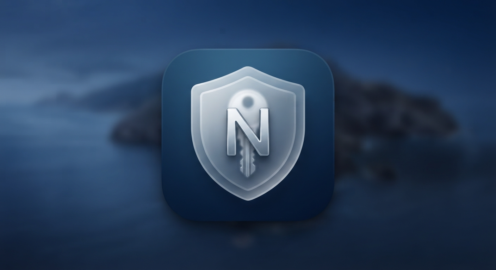
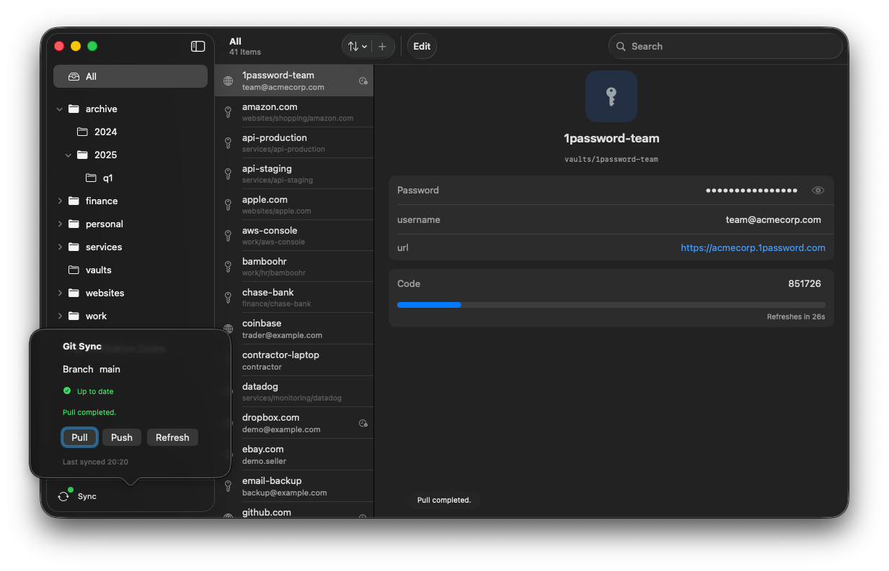
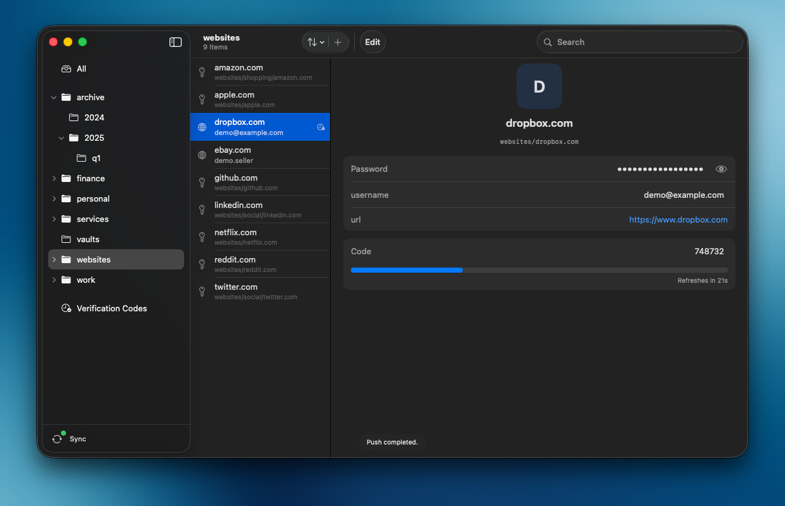
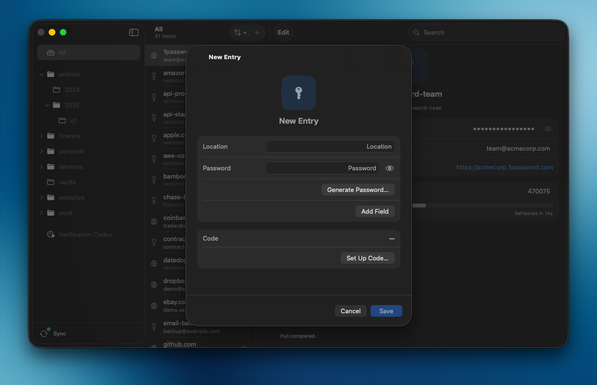
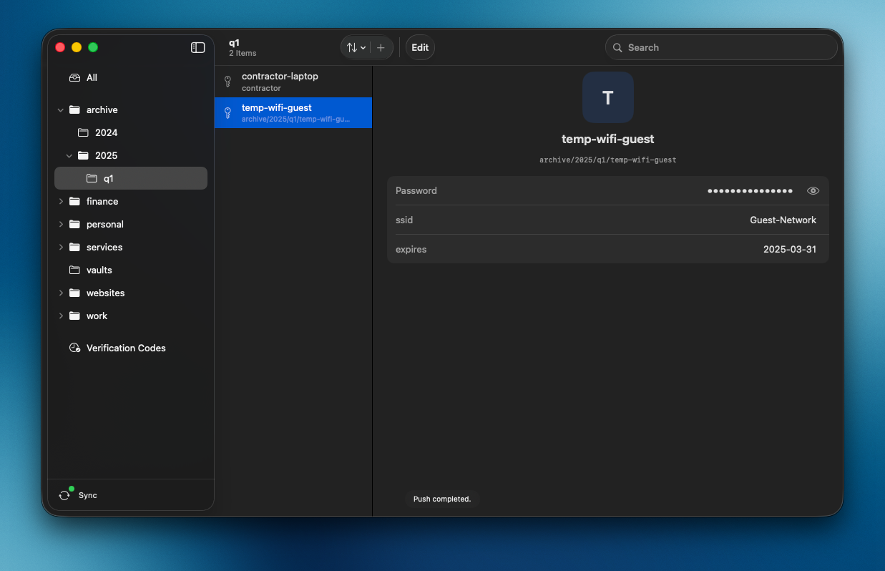
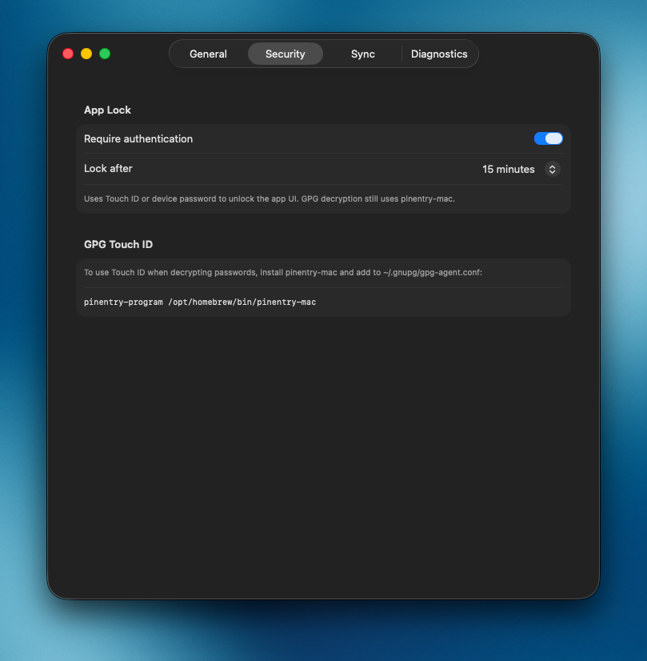

<p align="center">
  
</p>

<h1 align="center">NativePass</h1>

<p align="center">
  <strong>Native macOS client for <a href="https://www.passwordstore.org/">pass</a></strong><br>
  Browse nested folders, copy passwords, show TOTP codes, and sync with Git.<br>
  <em>Design inspired by the Passwords app by Apple.</em>
</p>

<p align="center">
  <a href="https://np.developer.pm/"></a>
  <a href="LICENSE"></a>
  
  
</p>

<p align="center">
  <a href="https://np.developer.pm/">Documentation</a> ·
  <a href="https://github.com/li-nd/NativePass/issues">Issues</a> ·
  <a href="#build">Build</a>
</p>

---



## Features

| | |
|---|---|
| **Browse** | Nested folders, search, custom fields |
| **Security** | GPG-backed store · App Lock (Touch ID) · clipboard auto-clear |
| **OTP** | TOTP codes via [`pass-otp`](https://github.com/tadfisher/pass-otp) |
| **Sync** | Git Pull / Push from the sidebar |
| **Quick Access** | Global hotkey `⌥⌘P` for fast copy |

## Requirements

```bash
brew install pass gnupg gnu-getopt pinentry-mac pass-otp
pass init YOUR_GPG_KEY_ID
```

Configure `pinentry-mac` so GPG can show a passphrase dialog (Touch ID friendly):

```bash
# ~/.gnupg/gpg-agent.conf  (Apple Silicon)
pinentry-program /opt/homebrew/bin/pinentry-mac
```

```bash
gpgconf --kill gpg-agent
```

Full steps: **[Setup guide](https://np.developer.pm/setup/)**.

## Screenshots

<p align="center">
  
  &nbsp;
  
</p>
<p align="center">
  
  &nbsp;
  
</p>

## Build

1. Open `NativePass.xcodeproj` in Xcode.
2. Select the **NativePass** scheme and run (`⌘R`).

Requires a working `pass` store on the machine (see above).

## Documentation

Published site: **[np.developer.pm](https://np.developer.pm/)**

| Page | Topic |
|------|--------|
| [Requirements](https://np.developer.pm/requirements/) | Homebrew packages |
| [Setup](https://np.developer.pm/setup/) | Store init & pinentry |
| [Plugins](https://np.developer.pm/plugins/) | pass-otp and more |
| [Usage](https://np.developer.pm/usage/) | Everyday workflow |
| [Troubleshooting](https://np.developer.pm/troubleshooting/) | Diagnostics |

### Preview docs locally

```bash
python3 -m venv .venv
source .venv/bin/activate
pip install -r requirements-docs.txt
mkdocs serve
```

Pages deploy automatically from `main` via [`.github/workflows/docs.yml`](.github/workflows/docs.yml).

## License

[MIT](LICENSE) © [Markus Lind](https://github.com/li-nd)
