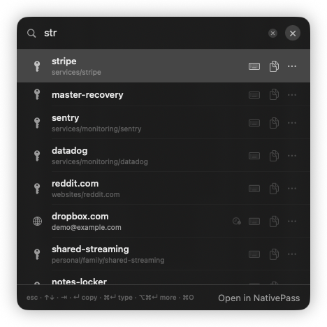
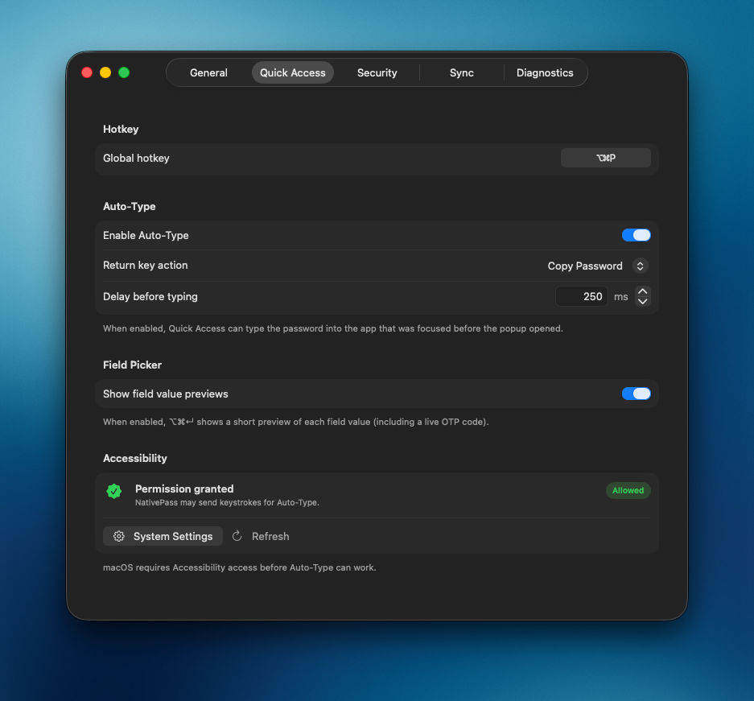

# Quick Access

A floating popup for finding an entry and copying or auto-typing a password (or other fields via **⌥⌘↵**) without opening the full NativePass window.

{ width="420" }

## Open and close

| How | Result |
|-----|--------|
| **Global hotkey** (default **⌥⌘P**) | Toggle: open if hidden, close if already open |
| Menu bar extra → **Quick Access** | Same toggle |
| **esc** / **⌘W** / ✕ | Close without copying |
| Click another app | Panel hides (`hidesOnDeactivate`) |
| App Lock engages | Popup is dismissed |

The panel appears near the mouse pointer (clamped to the current screen). NativePass must be running (including from the menu bar); the hotkey does not launch a quit app.

## Settings

Configure the hotkey and Auto-Type in **Settings → Quick Access**:

{ width="560" }

- **Global hotkey** — click the shortcut button, press a new combination (at least one modifier), or **Reset** to restore ⌥⌘P. Esc cancels recording.
- **Enable Auto-Type** — allow typing the password into the previously focused app
- **Return key action** — Copy Password or Type Password (↵ vs ⌘↵ swap when both are available)
- **Delay before typing** — pause after closing the popup so the target app can take focus (default 200 ms)
- **Show field value previews** — in the field picker (⌥⌘↵), show short value previews and a live OTP code (on by default)
- **Accessibility** — status, **System Settings**, and **Refresh**; macOS must allow NativePass under **Privacy & Security → Accessibility**

## Search and list

- Uses the same [fuzzy path search](search.md) as the main window (whole store, paths only).
- Empty query lists all entries (alphabetically by path).
- The list shows up to **50** matches; narrow the query if you need something further down.
- **↑ / ↓** change the selected row while the search field stays focused (including key-repeat while held). **⇥** moves focus to the list; **⇧⇥** (or **⇥** from the list) returns focus to search. The first result is selected automatically as you type.
- Rows show the entry name, optional username (only if that entry was decrypted earlier in this session), and icons for URL / OTP when metadata is known. Click the OTP icon to copy the current code.
- Each row has a copy button; when Auto-Type is enabled, a keyboard button types the password into the previously focused app. **↵** runs the configured primary action. The **⋯** button (or **⌥⌘↵**) opens the field picker for more values.

Footer hints summarize the shortcuts for the current Auto-Type / Return-key setup (for example `esc · ↑↓ · ⇥ · ↵ copy · ⌘↵ type · ⌥⌘↵ more · ⌘O`).

Search text in Quick Access is local to the popup — it does not sync with the main window search field.

## Copy password

1. Select an entry (or leave the first match selected).
2. Press **↵** (if primary action is Copy), **⌘↵** (when Auto-Type is enabled and primary is Type), or use the row’s copy button.
3. NativePass decrypts the entry, copies the **password** (first line) to the clipboard, shows a brief toast, then closes the popup after a short delay.

Clipboard auto-clear follows **Settings → General → Clipboard** (same as the main app). Decrypt failures stay in the footer; the popup stays open so you can retry or dismiss.

## Copy or type other fields

**⌥⌘↵** or the row **⋯** button opens a field picker for the selected entry:

| Field | Shown when |
|-------|------------|
| **Full entry** | Always — copy uses the full raw file; Auto-Type omits `otpauth://` lines |
| **Password** | Always |
| **Username** | Entry has `username`, `login`, or `user` |
| **OTP** | Entry has an `otpauth://` line |
| **Other fields** | Remaining keys (`url`, custom fields, notes, …) in file order |

Each row shows the field name on the left. When **Show field value previews** is enabled (default), an 8-character value preview appears on the right; the OTP row shows the live TOTP code and refreshes when the period expires.

- Action mode matches the main Quick Access keys: **↵** runs the primary action (Copy or Type from Settings), **⌘↵** runs the secondary when Auto-Type is enabled.
- **↑ / ↓** move in the menu, **esc** closes only the menu.

## Auto-Type

Optional alternative to the clipboard: NativePass restores the previously focused app and synthesizes keystrokes for the chosen value (password by default, or another field via **⌥⌘↵**).

Flow when typing:

1. Decrypt the entry (and resolve OTP if needed).
2. If **⌘** is still held (typical after **⌘↵**), Quick Access stays open with **Release ⌘ to type** until you release Command (or press **esc** to cancel).
3. Close Quick Access and restore the previous frontmost app.
4. Wait until the target app is frontmost, then apply the configured delay.
5. Type the value character by character (Unicode-aware; Tab / Return for `\t` / newlines).

If Accessibility is not granted, Quick Access stays open and shows an error in the footer.

## Open in the main window

**⌘O** or **Open in NativePass**:

- Closes Quick Access
- Activates the main window
- Selects **All** and the chosen entry (main-window search is cleared)

## App Lock

If NativePass is locked, Quick Access still opens and shows an unlock screen (Touch ID / device password). Success unlocks the **whole app**, then the normal search UI appears. Cancel or fail leaves the lock screen; you can try **Unlock** again or close the popup.

See [App Lock](app-lock.md).
