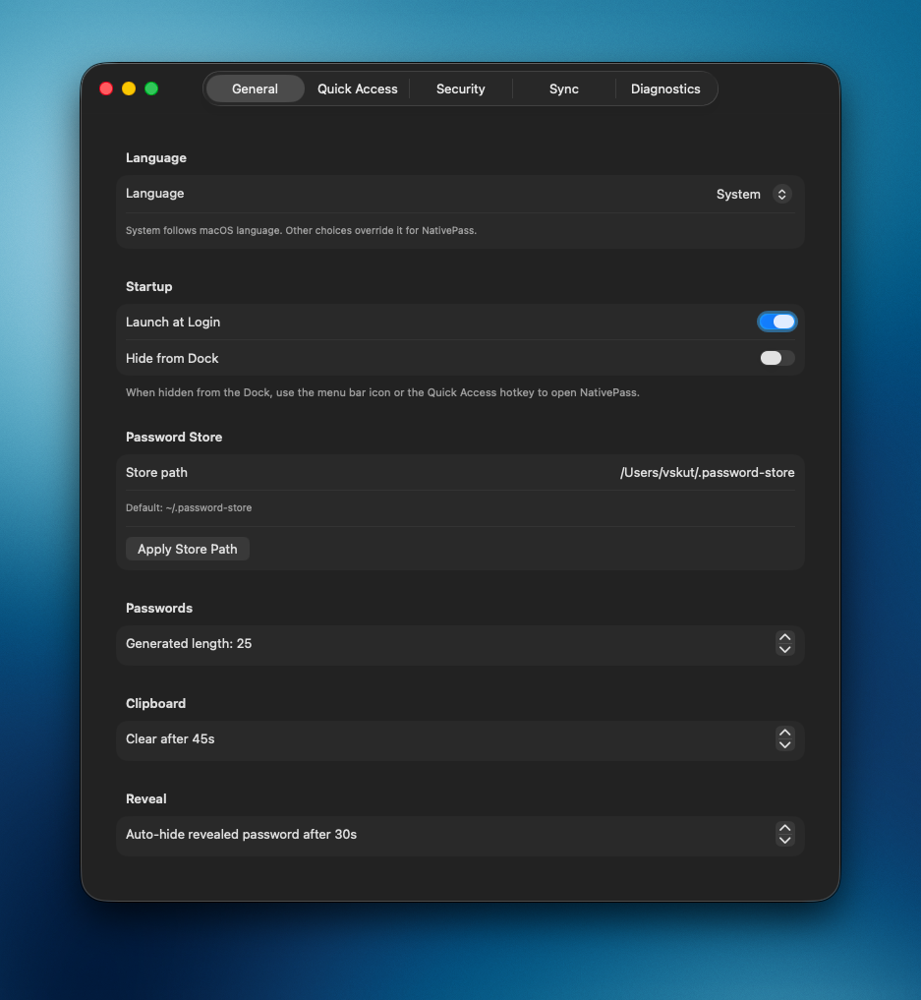

# Setup

## 1. Install NativePass

```bash
brew tap li-nd/apps
brew trust li-nd/apps
brew install --cask nativepass
```

Or download from [GitHub Releases](https://github.com/li-nd/NativePass/releases).  
Shared tap: [li-nd/homebrew-apps](https://github.com/li-nd/homebrew-apps).

!!! warning "Gatekeeper"
    Current builds are ad-hoc signed and **not notarized**. On first launch macOS may block the app — use **System Settings → Privacy & Security → Open Anyway**, or right-click the app → **Open**.

## 2. Install core tools

```bash
brew install pass gnupg gnu-getopt pinentry-mac
```

## 3. Initialize the password store

```bash
gpg --list-secret-keys --keyid-format LONG
pass init YOUR_GPG_KEY_ID
```

Optional Git backing:

```bash
pass git init
# then add a remote and push as usual
```

## 4. Configure pinentry (passphrase popup)

Without `pinentry-mac`, GPG may fail to prompt cleanly from the app.

Add this line to `~/.gnupg/gpg-agent.conf`:

```text
pinentry-program /opt/homebrew/bin/pinentry-mac
```

On Intel Homebrew, use:

```text
pinentry-program /usr/local/bin/pinentry-mac
```

Reload the agent:

```bash
gpgconf --kill gpg-agent
```

NativePass also shows this in **Settings → Security**:


!!! note "App Lock vs GPG"
    **App Lock** protects the NativePass UI (Touch ID / device password).  
    **GPG decryption** still uses pinentry when your private key needs a passphrase.

## 5. Open NativePass

1. Launch NativePass from Applications (or build from Xcode).
2. Open **Settings → Diagnostics** and confirm pass, GPG, and pinentry look healthy.
3. Set the store path under **Settings → General** if it is not `~/.password-store`.


