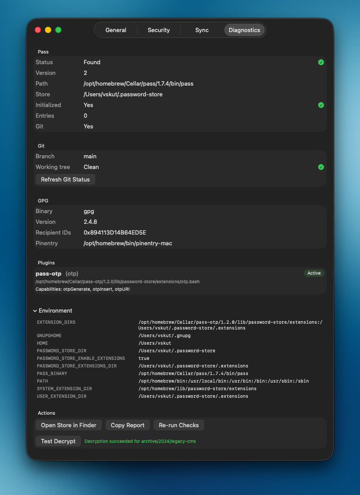

# Troubleshooting

## Settings → Diagnostics

Start here. It reports pass path/version, store status, GPG, pinentry, plugins, and environment.

Use **Re-run Checks** and **Test Decrypt** after fixing tools.

## Common issues

| Symptom | What to try |
|---------|-------------|
| **App blocked / can’t be opened** | Unsigned (not notarized) build — **Privacy & Security → Open Anyway**, or right-click → **Open** |
| **Setup Required / pass not found** | `brew install pass` and ensure `/opt/homebrew/bin` is on PATH for GUI apps |
| **Store not initialized** | `pass init YOUR_GPG_KEY_ID` |
| **Decryption failed / no pinentry** | Install `pinentry-mac` and set `pinentry-program` — see [Setup](setup.md) |
| **No OTP / empty Verification Codes** | `brew install pass-otp`, then open an OTP entry once |
| **pass ls / CLI errors about getopt** | `brew install gnu-getopt` |
| **Sync disabled or missing** | Store must be a Git repo (`pass git init`) |
| **Wrong `pass` binary (e.g. gopass)** | Prefer Homebrew `pass`; check Diagnostics → Pass → Path |
| **brew cask not found / tap issues** | `brew tap li-nd/apps` then `brew trust li-nd/apps` — see [homebrew-apps](https://github.com/li-nd/homebrew-apps) |

## App Lock vs decrypt prompts

- App Lock failing → macOS LocalAuthentication (Touch ID / password).
- Opening an entry failing → GPG + pinentry.

They are separate. Both can use Touch ID if configured, but each has its own setup.
