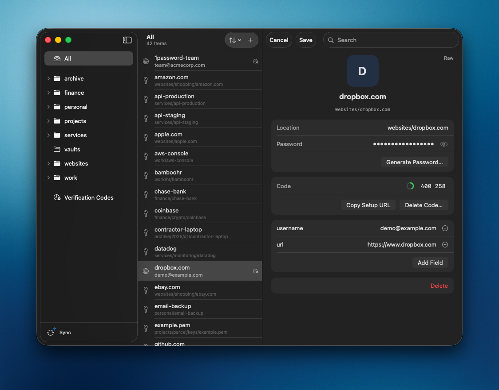
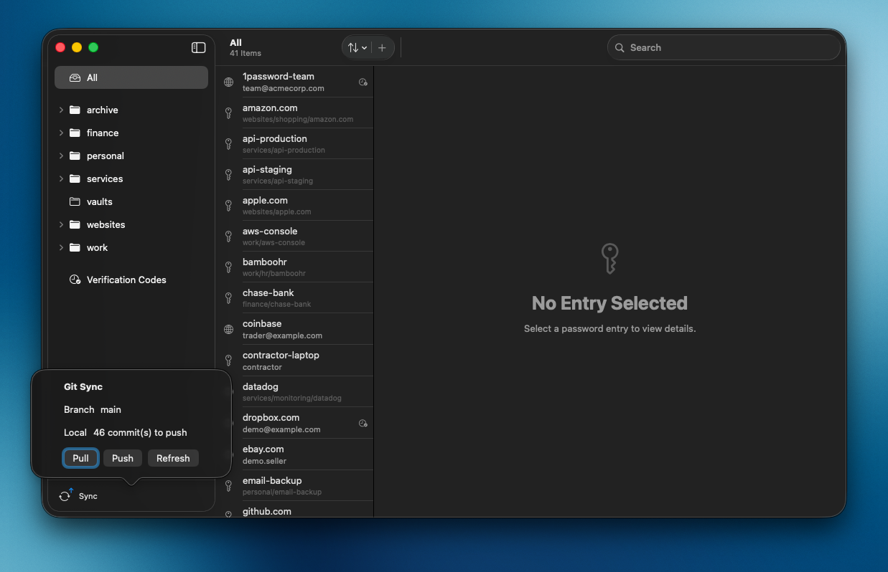

# Usage

Everyday workflow in the main window. Related topics: [Search](search.md), [Quick Access](quick-access.md), [App Lock](app-lock.md).

## Browse and open entries

- Sidebar folders mirror your store paths (including nested folders).
- Select an entry to decrypt and view details.
- Click a password or field to copy. Clipboard auto-clear is configurable in Settings.
- Use **Raw** / **Form** (top-right of the detail pane) to switch between structured fields and the decrypted file as plain text. The same control works while editing. **Edit** / **Cancel** / **Save** keep the current Raw or Form mode. **⌘C** still copies only the password (first line); **⌘⇧C** copies the entire raw entry.
- Find entries with [Search](search.md) (fuzzy match on paths).

## Create and edit

- **⌘N** or **+** — new entry (location, password, custom fields, optional OTP).
- **Edit** — change location, password, fields, or delete the entry.
- **Generate Password…** — fills a new password.

## Verification codes (TOTP)

Requires [pass-otp](plugins.md).

- Codes appear under **Code** when the entry contains `otpauth://…`.
- **Verification Codes** lists OTP entries after you have opened them at least once in this session (metadata comes from decrypt).

## Git sync

If the store is a Git repository:

- Use **Sync** in the sidebar for **Pull**, **Push**, and **Refresh**.
- **Settings → Sync** shows branch / ahead / behind.

